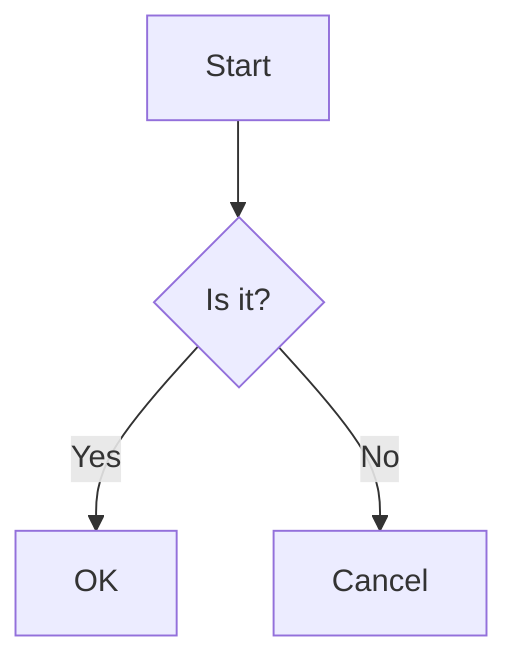

# PeekView 前端重新设计 v3.0

> **版本:** 3.0  
> **日期:** 2026-04-25  
> **状态:** 待评审  
> **目标:** 全新实现，摆脱历史包袱，GitHub + VitePress 风格  

---

## 1. 设计目标

### 核心体验
- **单文件代码查看**：GitHub 风格，语法高亮、行号、操作按钮
- **Markdown 阅读**：VitePress 风格排版，TOC 大纲导航，支持 Mermaid 图表
- **多文件项目**：简单文件树导航
- **响应式**：桌面端三栏，移动端抽屉 + 底部操作栏

### 不实现的功能
- 行内代码评论
- 文件历史/版本对比
- 复杂的文件树交互（拖拽、重命名等）

---

## 2. 技术栈

| 层级 | 技术 | 说明 |
|------|------|------|
| 框架 | Vue 3.4 + Vite 5 | Composition API，TypeScript |
| 路由 | Vue Router 4 | hash 模式（适配静态部署）|
| 状态 | Pinia 2 | 轻量级状态管理 |
| 代码高亮 | Shiki | 100+ 语言，VSCode 级着色 |
| Markdown | markdown-it + 插件 | GitHub Flavored Markdown |
| Mermaid | mermaid.js | 图表渲染，超时降级 |
| HTTP | Axios | API 请求封装 |
| UI | 纯 CSS | 无 UI 框架，完全自定义 Design Tokens |

---

## 3. 页面结构

### 3.1 桌面端（三栏布局）

```
┌─────────────────────────────────────────────────────────────────────────┐
│  ← Back   EntryTitle                            [Copy] [Download] [Wrap] │
├──────────────┬─────────────────────────────────────────┬──────────────────┤
│              │                                         │  📋 TOC          │
│ 📁 Files     │                                         │  ├── Introduction│
│ ├── main.py  │      Code / Markdown Content          │  ├── Usage       │
│ ├── README.md│                                         │  │   └── Details│
│ └── utils.js │                                         │  └── Reference  │
│              │                                         │                  │
└──────────────┴─────────────────────────────────────────┴──────────────────┘

- 左栏：文件树（多文件时显示，单文件时隐藏）
- 中栏：内容区（代码或 Markdown）
- 右栏：TOC（Markdown 文件且有标题时显示）
- 顶部：操作按钮（Copy, Download, Pack[多文件时], Wrap）
```

### 3.2 移动端（单栏 + 抽屉）

```
┌─────────────────────────────────────┐
│  ← EntryTitle                [⋮]    │  ← 点击⋮展开 TOC
├─────────────────────────────────────┤
│                                     │
│       Code / Markdown               │
│                                     │
│                                     │
├─────────────────────────────────────┤
│ [☰]  [Copy] [Download] [Pack] [Wrap]│  ← ☰ 展开文件树（多文件时）
└─────────────────────────────────────┘
```

**交互说明：**
- **⋮（右上角）**：点击展开 TOC 抽屉（仅 Markdown 有 TOC 时显示）
- **☰（左下角）**：仅多文件时显示，点击展开文件树抽屉
- 底部操作栏：Copy, Download, Pack[多文件时], Wrap

---

## 4. 组件设计

### 4.1 视图组件

#### EntryListView
- 网格布局，条目卡片
- 搜索栏、标签筛选
- 简单，不做重点

#### EntryDetailView
- 桌面端：三栏布局（文件树 | 内容 | TOC）
- 移动端：单栏 + 抽屉
- 动态显示/隐藏文件树（单/多文件）
- 动态显示/隐藏 TOC（仅 Markdown 有标题时）

### 4.2 功能组件

#### FileTree
```typescript
interface Props {
  files: FileResponse[];
  activeFileId: string | null;
}

interface Events {
  select: (file: FileResponse) => void;
}
```
- 简单递归列表，显示文件名
- 当前文件高亮
- 文件夹展开/折叠（如有层级）

#### CodeViewer（GitHub 风格）
```typescript
interface Props {
  content: string;
  language: string;
  filename: string;
  lineCount: number;
  wrap: boolean;
}
```

**DOM 结构：**
```html
<div class="code-viewer">
  <!-- Header: 文件名 + 语言 + 操作按钮 -->
  <div class="code-header">
    <span class="filename">main.py</span>
    <span class="lang">Python</span>
    <div class="actions">
      <button @click="copy">Copy</button>
      <button @click="toggleWrap">Wrap</button>
    </div>
  </div>

  <!-- Body: 行号 + 代码 -->
  <div class="code-body" :class="{ 'wrap-enabled': wrap }">
    <table>
      <tr v-for="(line, i) in lines" :key="i" :id="`L${i+1}`">
        <td class="line-num">{{ i+1 }}</td>
        <td class="line-content" v-html="highlightLine(line)"></td>
      </tr>
    </table>
  </div>
</div>
```

**特点：**
- 表格布局：行号左对齐，代码右对齐
- 每行有 `id="L{num}"`，支持 URL hash 跳转（如 `#L10`）
- 点击行号高亮整行
- Wrap 模式：代码自动换行
- 暗色/亮色切换时，Shiki 重新渲染

#### MarkdownViewer（VitePress 风格）
```typescript
interface Props {
  content: string;
}

interface Events {
  headings: (headings: TocHeading[]) => void;  // 向父组件传递 TOC 数据
}
```

**渲染流程：**
1. markdown-it 解析 Markdown → HTML
2. 提取 h2/h3/h4 标题，生成 TOC
3. Shiki 高亮代码块（ fenced code blocks ）
4. Mermaid 渲染图表（图表块）
5. 输出带锚点的 HTML

**TOC 锚点：**
- 标题自动生成 `id`（slugify）
- 格式：`#introduction`, `#usage`, `#usage-details`
- TOC 点击平滑滚动到对应位置

**Mermaid 支持：**
```markdown

```

- 渲染超时：5秒，超时显示原始代码
- 暗色/亮色模式自动切换 Mermaid 主题

#### TocNav
```typescript
interface Props {
  headings: TocHeading[];
  activeId: string | null;
}

interface TocHeading {
  level: number;      // 2, 3, 4
  text: string;       // 显示文本
  id: string;         // 锚点 ID
}
```

- 桌面端：右侧固定侧边栏
- 移动端：抽屉菜单（从右侧滑出）
- 当前阅读位置高亮
- 点击平滑滚动

#### ActionBar
```typescript
interface Props {
  canCopy: boolean;
  canDownload: boolean;
  canWrap: boolean;      // 代码文件可换行
  canPack: boolean;      // 多文件时可打包下载
  wrap: boolean;         // 当前 wrap 状态
}
```

- 桌面端：顶部按钮组
- 移动端：底部操作栏

### 4.3 全局组件

#### ThemeToggle
- 切换暗色/亮色模式
- 保存用户偏好到 localStorage
- 监听系统主题变化

---

## 5. 样式设计

### 5.1 Design Tokens

基于 GitHub Primer + VitePress 风格：

```css
:root {
  /* Spacing */
  --space-1: 4px;   --space-2: 8px;   --space-3: 12px;
  --space-4: 16px;  --space-5: 24px;  --space-6: 32px;

  /* Typography */
  --font-xs: 12px;  --font-sm: 14px;  --font-md: 16px;
  --font-lg: 20px;  --font-xl: 24px;
  --font-mono: 'JetBrains Mono', 'Fira Code', Consolas, monospace;

  /* Border */
  --radius-sm: 3px;  --radius-md: 6px;  --radius-lg: 8px;

  /* Light Theme */
  --bg-primary: #ffffff;
  --bg-secondary: #f6f8fa;
  --bg-tertiary: #f3f4f6;
  --bg-code: #f6f8fa;
  
  --border-color: #d0d7de;
  --border-hover: #8c959f;
  
  --text-primary: #1f2328;
  --text-secondary: #656d76;
  --text-tertiary: #8c959f;
  
  --accent-color: #0969da;
  --accent-hover: #0550ae;
}

[data-theme="dark"] {
  --bg-primary: #0d1117;
  --bg-secondary: #161b22;
  --bg-tertiary: #21262d;
  --bg-code: #161b22;
  
  --border-color: #30363d;
  --border-hover: #8b949e;
  
  --text-primary: #e6edf3;
  --text-secondary: #8b949e;
  --text-tertiary: #6e7681;
  
  --accent-color: #3b82f6;
  --accent-hover: #2563eb;
}
```

### 5.2 代码块样式（GitHub 风格）

```css
.code-viewer {
  border: 1px solid var(--border-color);
  border-radius: var(--radius-md);
  overflow: hidden;
}

.code-header {
  padding: var(--space-2) var(--space-3);
  background: var(--bg-secondary);
  border-bottom: 1px solid var(--border-color);
  display: flex;
  align-items: center;
  gap: var(--space-2);
}

.code-body {
  overflow-x: auto;
  background: var(--bg-code);
}

.code-body table {
  width: 100%;
  border-collapse: collapse;
}

.line-num {
  width: 1%;
  min-width: 50px;
  padding: 0 var(--space-3);
  text-align: right;
  color: var(--text-tertiary);
  background: var(--bg-secondary);
  border-right: 1px solid var(--border-color);
  user-select: none;
}

.line-content {
  padding: 0 var(--space-3);
  white-space: pre;
  tab-size: 4;
}

.line-content.wrap-enabled {
  white-space: pre-wrap;
  word-break: break-all;
}

/* 高亮当前行 */
tr:target,
tr.highlight {
  background: var(--accent-light);
}
```

### 5.3 Markdown 样式（VitePress 风格）

```css
.markdown-body {
  line-height: 1.7;
  color: var(--text-primary);
}

.markdown-body h1,
.markdown-body h2,
.markdown-body h3 {
  margin-top: var(--space-6);
  margin-bottom: var(--space-4);
  font-weight: 600;
  border-bottom: 1px solid var(--border-color);
  padding-bottom: var(--space-2);
}

.markdown-body h1 { font-size: var(--font-xl); }
.markdown-body h2 { font-size: var(--font-lg); }
.markdown-body h3 { font-size: var(--font-md); }

.markdown-body h2:target,
.markdown-body h3:target {
  /* 锚点跳转时高亮 */
  background: var(--accent-light);
}

.markdown-body code {
  background: var(--bg-code);
  padding: 0.2em 0.4em;
  border-radius: var(--radius-sm);
  font-family: var(--font-mono);
  font-size: 0.9em;
}

.markdown-body pre {
  background: var(--bg-code);
  border-radius: var(--radius-md);
  padding: var(--space-4);
  overflow-x: auto;
}

.markdown-body pre code {
  background: transparent;
  padding: 0;
}

.markdown-body table {
  width: 100%;
  border-collapse: collapse;
  margin: var(--space-4) 0;
}

.markdown-body th,
.markdown-body td {
  padding: var(--space-2) var(--space-3);
  border: 1px solid var(--border-color);
}

.markdown-body th {
  background: var(--bg-secondary);
  font-weight: 600;
}

.markdown-body tr:nth-child(2n) {
  background: var(--bg-secondary);
}
```

### 5.4 响应式断点

```css
/* 移动端优先 */
@media (min-width: 768px) {
  /* 平板：文件树可展开 */
}

@media (min-width: 1024px) {
  /* 桌面：三栏布局 */
  .entry-layout {
    display: grid;
    grid-template-columns: 260px 1fr 220px;
  }
}
```

---

## 6. 路由设计

| 路径 | 组件 | 说明 |
|------|------|------|
| `/` | EntryListView | 条目列表 |
| `/#/entry/:slug` | EntryDetailView | 条目详情 |
| `/#/entry/:slug?file=:filename` | EntryDetailView | 指定文件 |

**Hash 定位：**
- `#L10` - 跳转到代码第 10 行
- `#introduction` - 跳转到 Markdown 标题

---

## 7. API 集成

### 7.1 API Client

```typescript
// api/client.ts
class PeekAPI {
  async listEntries(params?: ListParams): Promise<EntryList>;
  async getEntry(slug: string): Promise<EntryDetail>;
  async getFileContent(slug: string, fileId: number): Promise<string>;
  downloadFile(slug: string, fileId: number): string; // 返回 URL
  downloadPack(slug: string): string; // 多文件打包下载
}

export const api = new PeekAPI();
```

### 7.2 数据模型

```typescript
// types/index.ts
interface Entry {
  id: number;
  slug: string;
  summary: string;
  tags: string[];
  status: 'active' | 'expired';
  files: File[];
  createdAt: string;
}

interface File {
  id: number;
  path: string;
  filename: string;
  language: string | null;
  isBinary: boolean;
  size: number;
  lineCount: number;
}
```

---

## 8. 状态管理

使用 Pinia 管理全局状态：

```typescript
// stores/theme.ts
export const useThemeStore = defineStore('theme', () => {
  const theme = ref<'light' | 'dark'>('dark');
  const toggle = () => { /* ... */ };
  return { theme, toggle };
});

// stores/entry.ts
export const useEntryStore = defineStore('entry', () => {
  const currentEntry = ref<Entry | null>(null);
  const activeFile = ref<File | null>(null);
  const fileContent = ref<string>('');
  const wrapEnabled = ref(false);
  
  async function loadEntry(slug: string);
  async function loadFile(file: File);
  
  return {
    currentEntry, activeFile, fileContent, wrapEnabled,
    loadEntry, loadFile
  };
});
```

---

## 9. 性能优化

1. **代码分割**
   - 按路由懒加载
   - Shiki 语言包按需加载

2. **缓存**
   - 条目数据缓存 5 分钟
   - 文件内容本地缓存（可选）

3. **渲染优化**
   - Markdown 大文件虚拟滚动（如需要）
   - Mermaid 图表异步渲染

---

## 10. 测试策略

1. **单元测试**
   - 组件渲染测试（Vitest）
   - API Client 模拟测试

2. **E2E 测试**
   - Playwright：
     - 代码高亮验证
     - Markdown TOC 跳转
     - 响应式布局切换
     - 主题切换

3. **视觉回归**
   - 截图对比（暗色/亮色）

---

## 11. 项目结构

```
frontend-v3/
├── public/
├── src/
│   ├── api/
│   │   └── client.ts
│   ├── assets/
│   ├── components/
│   │   ├── CodeViewer.vue
│   │   ├── MarkdownViewer.vue
│   │   ├── FileTree.vue
│   │   ├── TocNav.vue
│   │   ├── ActionBar.vue
│   │   └── ThemeToggle.vue
│   ├── composables/
│   │   ├── useShiki.ts
│   │   ├── useMarkdown.ts
│   │   └── useMermaid.ts
│   ├── stores/
│   │   ├── theme.ts
│   │   └── entry.ts
│   ├── styles/
│   │   ├── variables.css
│   │   ├── markdown.css
│   │   └── code.css
│   ├── types/
│   │   └── index.ts
│   ├── views/
│   │   ├── EntryListView.vue
│   │   └── EntryDetailView.vue
│   ├── App.vue
│   ├── main.ts
│   └── router.ts
├── index.html
├── package.json
├── tsconfig.json
└── vite.config.ts
```

---

## 12. 开发计划

| 阶段 | 内容 | 预计时间 |
|------|------|----------|
| P1 | 基础架构（Vite + Vue + Pinia + Router） | 半天 |
| P2 | Design Tokens + 全局样式 | 半天 |
| P3 | CodeViewer（GitHub 风格） | 1 天 |
| P4 | MarkdownViewer + TOC（VitePress 风格） | 1 天 |
| P5 | Mermaid 集成 | 半天 |
| P6 | EntryDetailView 布局 | 半天 |
| P7 | 响应式（移动端适配） | 半天 |
| P8 | EntryListView + 整合测试 | 半天 |

**总计：4-5 天**

---

## 13. 验收标准

- [ ] 单文件代码：GitHub 风格高亮、行号、Wrap、Copy
- [ ] Markdown：VitePress 风格排版、TOC 跳转、Mermaid 图表
- [ ] 多文件：文件树导航、打包下载
- [ ] 响应式：桌面三栏、移动端抽屉
- [ ] 暗色/亮色模式切换正常
- [ ] URL hash 定位代码行/Markdown 标题
- [ ] 所有交互流畅无卡顿
