# PlantUML 语法速查手册（PeekView 版）

> **用途**：Agent 写 PlantUML 前查此文档，减少语法错误；渲染失败时查此文档定位问题。
> **验证基准**：所有示例均在 PeekView v0.1.64（plantuml.js v1.2026.6 TeaVM 版）实跑通过。
> **更新日期**：2026-06-21

---

## 一、图类型速查表

PeekView 支持所有 PlantUML 图类型。每种图用不同的起止标记，markdown 代码块语言统一标 `plantuml`。

| # | 图类型 | 起止标记 | 适用场景 | 官方文档 |
|---|--------|---------|---------|---------|
| 1 | 时序图 | `@startuml`/`@enduml` | 交互流程、API 调用链 | [sequence](https://plantuml.com/sequence-diagram) |
| 2 | 类图 | `@startuml`/`@enduml` | 面向对象设计、继承关系 | [class](https://plantuml.com/class-diagram) |
| 3 | 组件图 | `@startuml`/`@enduml` | 系统架构、模块依赖 | [component](https://plantuml.com/component-diagram) |
| 4 | 活动图 | `@startuml`/`@enduml` | 业务流程、算法步骤 | [activity](https://plantuml.com/activity-diagram-beta) |
| 5 | 状态图 | `@startuml`/`@enduml` | 状态机、生命周期 | [state](https://plantuml.com/state-diagram) |
| 6 | 部署图 | `@startuml`/`@enduml` | 物理部署、网络拓扑 | [deployment](https://plantuml.com/deployment-diagram) |
| 7 | 用例图 | `@startuml`/`@enduml` | 需求分析、用户场景 | [usecase](https://plantuml.com/use-case-diagram) |
| 8 | 脑图 | `@startmindmap`/`@endmindmap` | 知识结构、功能分解 | [mindmap](https://plantuml.com/mindmap-diagram) |
| 9 | 甘特图 | `@startgantt`/`@endgantt` | 项目计划、任务排期 | [gantt](https://plantuml.com/gantt-diagram) |
| 10 | 网络图 | `@startnwdiag`/`@endnwdiag` | 网络架构、IP 分配 | [nwdiag](https://plantuml.com/nwdiag) |
| 11 | 工作分解 | `@startwbs`/`@endwbs` | 项目分解、组织架构 | [wbs](https://plantuml.com/wbs-diagram) |
| 12 | JSON 可视化 | `@startjson`/`@endjson` | 配置展示、数据结构 | [json](https://plantuml.com/json) |
| 13 | YAML 可视化 | `@startyaml`/`@endyaml` | 配置展示 | [yaml](https://plantuml.com/yaml) |
| 14 | 线框图 | `@startsalt`/`@endsalt` | UI 原型设计 | [salt](https://plantuml.com/salt) |
| 15 | 正则图 | `@startregex`/`@endregex` | 正则表达式可视化 | [regex](https://plantuml.com/regex) |
| 16 | ER 图 | `@startuml`/`@enduml` | 数据库设计 | [er-diagram](https://plantuml.com/er-diagram) |
| 17 | 时序图(定时) | `@startuml`/`@enduml` | 数字电路时序 | [timing](https://plantuml.com/timing-diagram) |

**关键规则**：markdown 代码块语言**统一写 `plantuml`**，不要写 `uml`/`sequence`/`gantt` 等。

```markdown
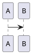
```

---

## 二、最小可用示例（均经实跑验证）

### 1. 时序图

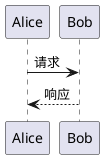

### 2. 类图

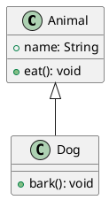

### 3. 组件图

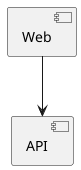

### 4. 活动图

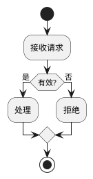

### 5. 状态图

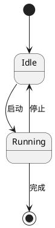

### 6. 部署图

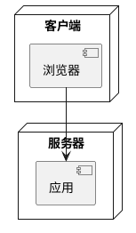

### 7. 用例图

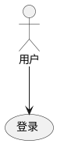

### 8. 脑图

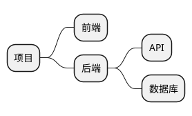

### 9. 甘特图

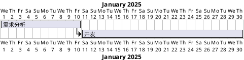

### 10. 网络图

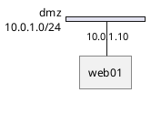

### 11. WBS 工作分解

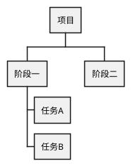

### 12. JSON 可视化

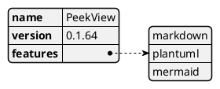

---

## 三、常见陷阱（真实案例）

以下陷阱均在 PeekView 实际使用中发现，会导致 `Syntax Error` 渲染失败。

### 陷阱 1：甘特图日期范围单独一行（高频）

**错误写法**：
```plantuml
@startgantt
projectscale monthly
2025-01-01 to 2025-09-30    ← 单独一行，缺少动词
[Task A] lasts 5 days
@endgantt
```

**正确写法**：
```plantuml
@startgantt
projectscale monthly
Project starts 2025-01-01    ← 必须有 "Project starts" 等动词
[Task A] lasts 5 days
@endgantt
```

**规则**：gantt 中日期不能单独出现，必须搭配动词：
- `Project starts 2025-01-01` — 设置项目开始日期
- `2025-01-01 to 2025-09-30 is closed` — 关闭某日期范围
- `2025-01-01 to 2025-09-30 are colored in salmon` — 着色某日期范围
- `Print between 2025-01-01 and 2025-09-30` — 设置打印范围

### 陷阱 2：nwdiag address 缺等号和引号

**错误写法**：
```plantuml
@startnwdiag
nwdiag {
  network dmz {
    address 10.0.1.x/24      ← 缺等号和引号
    web01 [address = "10.0.1.10"];
  }
}
@endnwdiag
```

**正确写法**：
```plantuml
@startnwdiag
nwdiag {
  network dmz {
    address = "10.0.1.0/24"  ← 必须有 = 和引号
    web01 [address = "10.0.1.10"];
  }
}
@endnwdiag
```

**规则**：nwdiag 的 `address` 赋值必须用 `=` + 引号包裹的字符串。network-level 和 node-level 都一样。

### 陷阱 3：用错起止标记

**错误**：脑图用 `@startuml`
```plantuml
@startuml          ← 错！脑图必须用 @startmindmap
+ 根节点
++ 子节点
@enduml
```

**正确**：
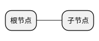

**规则**：每种图类型有自己的起止标记，不能混用。见速查表。

### 陷阱 4：活动图 if 语法

**错误**：else if 不用 elseif
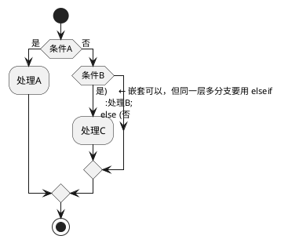

这个写法在嵌套场景是对的。但如果想在同一 if 块内多分支：

```plantuml
@startuml
start
if (条件A) then (值1)
  :处理A;
elseif (值2) then
  :处理B;
else (其他)
  :处理C;
endif
stop
@enduml
```

**规则**：同层多分支用 `elseif`，不是多个 `else if`。

### 陷阱 5：中文标识符的引号

**正确**：中文节点名无需引号
```plantuml
@startuml
actor 指挥员
participant "态势客户端" as Client   ← 含空格或特殊字符时用引号
指挥员 -> Client: 下达指令
@enduml
```

**规则**：纯中文/英文标识符不用引号；含空格、括号、特殊字符时用双引号包裹，可用 `as` 取别名。

---

## 四、TeaVM 版已知限制

PeekView 使用 plantuml.js v1.2026.6（TeaVM 编译版），与 Java 原版有少量差异：

| 特性 | Java 原版 | TeaVM 版（PeekView） | 说明 |
|------|----------|---------------------|------|
| 基础图类型 | 全部支持 | 全部支持 | 时序/类/组件/活动/状态/部署/用例 |
| mindmap/gantt/nwdiag/wbs/json/yaml | 全部支持 | 全部支持 | T018 已修复前端验证器拦截 |
| `!include` 远程 URL | 支持 | **不支持** | TeaVM 版无网络能力 |
| `!include` 本地文件 | 支持 | **不支持** | 浏览器沙箱限制 |
| `!include <stdlib/...>` 标准库 | 支持 | 部分支持 | 内置 stdlib 可用，外部不可 |
| `@start` 带文件名参数 | 支持 | 支持 | `@startuml(diagram.png)` 可用 |
| `!theme` 主题 | 支持 | 部分支持 | 内置主题可用 |
| 大图渲染 | 无限制 | **4096px 限制** | 超过 4096x4096 像素的图会报 "Diagram too large" |
| `!function`/`!procedure` | 支持 | 支持 | 预处理宏可用 |
| `skinparam` | 支持 | 支持 | 样式参数可用 |

**遇到 "Diagram too large" 时**：精简图内容，或拆分为多个小图。

---

## 五、排错流程

当 PlantUML 块渲染失败时（显示语法错误页或空白），按以下步骤排查：

### 步骤 1：看错误页行号

plantuml.js 的语法错误页会显示：
```
[From textarea (line N) ]
@startgantt
...
← 第 N 行附近的代码
Syntax Error? (Assumed diagram type: gantt)
```

`line N` 指向解析失败的位置，重点检查该行及上一行。

### 步骤 2：对照最小示例

把你的代码和本文档第二节的「最小可用示例」对比，逐步删减到最小重现。常见问题：
- 起止标记是否正确？（见速查表）
- 赋值是否漏了 `=` 或引号？
- 日期/数字是否单独一行缺动词？

### 步骤 3：官方在线服务器交叉验证

把代码粘贴到 https://www.plantuml.com/plantuml/uml/ 在线编辑器：
- 如果在线服务器也报错 → 语法确实有问题，对照官方文档修正
- 如果在线服务器正常但 PeekView 报错 → 可能是 TeaVM 版限制，查第四节

### 步骤 4：二分法定位

像这样逐步删减代码，直到找到触发错误的最小片段：

```
原始代码（报错）
  ↓ 删掉一半内容
还是报错？→ 问题在被保留的那半
不报错了？→ 问题在被删掉的那半
  ↓ 重复，直到定位到具体行
```

### 步骤 5：查看 console 错误

浏览器 F12 打开开发者工具，看 console 里的 `PlantUML render failed` 错误信息。PeekView 的前端验证器（`validateSource`）会在渲染前检查起止标记，如果标记不对会直接报 `missing @start` 或 `unbalanced @start/@end`。

---

## 六、进阶语法速查

### 6.1 通用元素（所有 @startuml 图可用）

```
title 标题                    设置图表标题
caption 说明文字              底部说明
header 页眉                   顶部页眉
footer 页脚                   底部页脚
legend 图例                   图例
skinparam backgroundColor #FFF  背景色
```

### 6.2 时序图专用

```
autonumber                    自动编号
participant "名" as 别名       定义参与者
actor 用户                     火柴人
database "DB"                  数据库
queue "MQ"                     消息队列
A -> B : 消息                   实线箭头
A --> B : 响应                  虚线箭头
A -> A : 自调用                 自调用
activate A                     激活生命线
deactivate A                   取消激活
loop 条件 ... end              循环
alt 条件 ... else ... end      条件分支
opt 条件 ... end               可选
par ... end                    并行
note left/right of A : 备注     备注
```

### 6.3 类图专用

```
class 名称 { ... }             定义类
abstract class 名称             抽象类
interface 名称                  接口
enum 名称 { ... }              枚举
A <|-- B                       B 继承 A（实线三角）
A <|.. B                       B 实现接口 A（虚线三角）
A *-- B                        A 聚合 B（实线菱形）
A o-- B                        A 包含 B（虚线菱形）
A --> B                        A 关联 B
A ..> B                        A 依赖 B
```

### 6.4 甘特图专用

```
Project starts 2025-01-01      项目开始日期（注意：不是 "2025-01-01 to ..."）
[任务名] lasts N days          任务持续 N 天
[任务名] lasts N weeks         任务持续 N 周
[任务名] starts at [其他]'s end  任务在其他任务结束后开始
[任务名] starts N days after [其他]'s end  延迟 N 天开始
[任务名] happens at [其他]'s end  里程碑（瞬间事件）
projectscale monthly           切换为月视图（daily/weekly/monthly/quarterly/yearly）
saturday are closed            周六关闭
[任务名] is colored in red      任务着色
```

### 6.5 脑图专用

```
@startmindmap
+ 根                          一级
++ 分支A                      二级（右侧）
+++ 子分支                    三级
-- 分支B                      二级（左侧）
--- 子分支                    三级（左侧）
@endmindmap

* 根                          替代语法（只用 + 方式）
** 分支
*** 子分支
```

### 6.6 网络图专用

```
@startnwdiag
nwdiag {
  network 网段名 {
    address = "10.0.1.0/24"    network-level 地址（必须有 = 和引号）
    节点1 [address = "10.0.1.10"];   node-level 地址
    节点2 [address = "10.0.1.11"];
  }
  network 另一网段 {
    address = "10.0.2.0/24"
    节点1 [address = "10.0.2.10"];   同一节点可在多个网段
  }
  group {                       分组
    color = "#FFAAAA"
    节点1
    节点2
  }
}
@endnwdiag
```

---

## 七、官方资源

| 资源 | 链接 | 用途 |
|------|------|------|
| 语言规范总览 | https://plantuml.com/sitemap-language-specification | 30+ 图类型索引 |
| 在线编辑器 | https://www.plantuml.com/plantuml/uml/ | 在线测试、交叉验证 |
| PDF 完整指南 | https://plantuml.com/guide | 可下载的完整手册 |
| 主题画廊 | https://the-lum.github.io/puml-themes-gallery/ | 预置主题预览 |
| 标准库 | https://plantuml.com/stdlib | 可 include 的图标/库 |
| GitHub | https://github.com/plantuml/plantuml | 源码、issues |
| Hitchhiker's Guide | https://crashedmind.github.io/PlantUMLHitchhikersGuide | 第三方实战指南 |
| 论坛 | https://forum.plantuml.net | 问答、疑难排查 |
