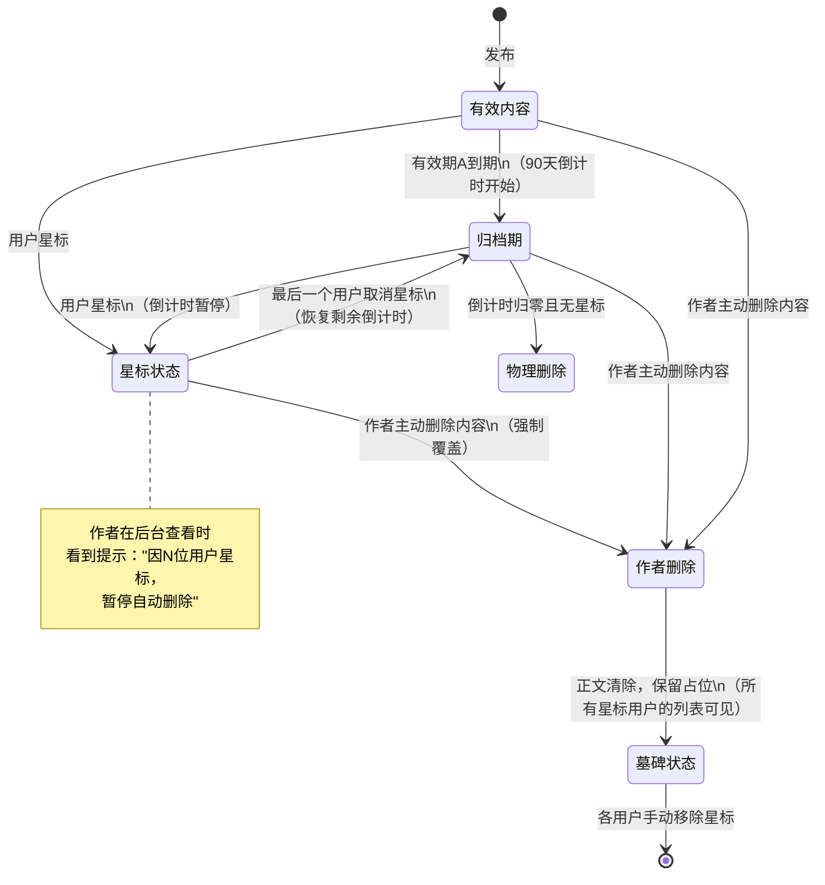

# 星标功能与内容生命周期管理 需求文档

**版本：** V2.0（最终全量版）
**日期：** 2026-08-12
**状态：** 待评审

## 1. 需求背景与目标

### 1.1 背景

平台内容具有时效性，存在"有效期内可访问 → 归档（Archived）→ 物理删除"的生命周期。在此前提下，用户使用的"星标"功能（代表高价值、强留存意愿）与内容自动删除逻辑存在冲突。

同时，星标不仅是个人收藏行为，也是内容热度的体现。平台需要展示星标总数以辅助用户决策；同时，作者作为内容所有者，需要知晓自己的内容为何"过期未删"，并保留最终处置权。

### 1.2 核心目标

- **资产保护**：确保用户星标的内容不被系统自动删除，保护用户的数字收藏资产。
- **预期管理**：向用户清晰传递内容的时效状态，避免因内容突然消失产生困惑或信任危机。
- **合规与成本**：在保障用户体验的前提下，合理控制存储成本，并尊重作者主动删除的意愿。
- **掌控感**：将清理失效内容的最终决定权交还给用户，而非系统强制清除。
- **透明度与社交证明**：展示内容的星标热度，并向作者透明化"星标豁免删除"的机制原因。
- **作者主权**：确保作者的删除权限始终高于用户的星标豁免权。

## 2. 名词定义

| 术语 | 定义 |
| :--- | :--- |
| **有效期（A）** | 内容正常可访问的公开期限（如活动期、免费阅读期）。 |
| **Archived（归档期）** | 内容过期后的软删除缓冲阶段，持续 **90天**。 |
| **物理删除** | 内容数据彻底从数据库清除，无法恢复。 |
| **星标（Star/Favorite）** | 用户主动标记的高价值收藏行为，代表强留存意图。 |
| **星标计数** | 内容被所有用户星标的总次数，作为内容热度指标。 |
| **墓碑（Tombstone）** | 内容实体删除后，为用户保留的标题+封面占位卡片，用于提示内容状态。 |

## 3. 核心业务逻辑

### 3.1 内容生命周期的流转规则

| 阶段 | 触发条件 | 用户可见状态 | 系统行为 |
| :--- | :--- | :--- | :--- |
| **有效** | 内容发布或有效期内 | 正文完全可读；显示星标总数 | 正常展示；计数实时更新 |
| **归档期** | 有效期A结束 | 正文可读（或带"已过期"弱提示） | 进入Archived，**90天倒计时开始** |
| **星标豁免** | 用户在任一阶段点击"星标" | 标记为星标状态 | **暂停**Archived的倒计时（若已进入归档期则暂停剩余天数；若在有效期内标记，则进入归档期后倒计时暂停） |
| **取消星标** | 用户主动取消 | 星标标记消失 | **恢复**Archived的剩余倒计时（非立即删除），倒计时归零后物理删除 |
| **物理删除** | Archived倒计时归零 | 内容不可见（列表剔除） | 彻底清除数据 |
| **作者主动删除（含星标）** | 作者在后台点击"删除" | 所有用户的星标列表保留"墓碑"，正文提示"作者已删除" | **强制覆盖**：无论星标状态或归档状态，立即清除正文，仅保留墓碑记录；星标计数随之隐藏/清零（内容不可访问） |

### 3.2 关键状态变化说明

1.  **星标豁免权**：星标是暂停归档倒计时的"令牌"。只要星标状态存在（**至少1个用户星标**），系统绝不自动删除内容。
2.  **取消星标≠立即删除**：取消星标仅代表用户放弃豁免权，内容**重新进入剩余归档倒计时**，给予用户操作缓冲期。
3.  **作者删除优先**：作者删除是最高优先级操作，不受星标保护，以尊重内容创作者权益。
4.  **星标计数的实时性**：所有用户可见的星标总数应实时或准实时（延迟<1分钟）更新，但为避免刷量，同一用户对同一内容只计1次。

## 4. 产品交互设计

### 4.1 内容详情页（平台前台）

- **星标按钮与计数**：在文章/内容头部或底部固定区域，展示星标图标 + 数字（如"⭐ 328"）。点击星标时，数字即时+1/-1（乐观更新），若网络失败则回滚。
- **悬浮提示（Hover）**：鼠标悬停在星标数字上时，提示"有多少位用户标记了此内容"（如"328人认为值得收藏"），增强社交证明感。

### 4.2 星标入口即时反馈（针对收藏者）

- **即时提示**：用户点击星标时，若内容已进入归档期或即将过期，使用轻提示（Toast）告知："该内容将于X月X日归档，星标后可长期保存。"
- **倒计时显示**：在星标列表中，针对处于"失效边缘"（如剩余期限<7天）的内容，展示红色倒计时标签（如"剩余3天"）。

### 4.3 星标列表（用户收藏夹）

- **状态分类**：提供以下分类筛选标签：
    - **全部**（默认）
    - **有效内容**（可正常阅读）
    - **即将失效**（按剩余时间升序排列）
    - **已失效/已删除**（显示"墓碑"状态）
- **墓碑卡片样式**：标题保留（加删除线或置灰），封面图保留，右下方覆盖"内容已失效"或"作者已删除"的水印/标签。点击后进入详情页，展示失效原因提示，并提供"取消星标"或"移除"按钮。

### 4.4 作者后台-Archived管理页面

作者在查看自己"已归档（Archived）"的内容列表时，会遇到"过了90天还没删"的情况。此时需显式告知原因，并赋予操作入口：

- **星标豁免状态标签**：在归档内容卡片上，若该内容因被其他用户星标而暂停了90天倒计时，显示特殊标签：**"因被 N 位用户星标，已暂停自动删除"**（N为实际星标人数）。
- **倒计时提示优化**：原本的"剩余X天删除"文案，替换为 **"星标豁免中，暂不自动删除"** ，并附上小问号图标（❓），悬停或点击后弹出详细说明弹窗：

    > "此内容因获得 **N** 位用户的星标，已暂停90天归档删除倒计时。您作为作者，仍可随时手动删除此内容。手动删除后，所有用户的星标将变为'内容已删除'状态。"

- **手动删除按钮（强化）** ：在归档列表的操作列，提供醒目的 **"立即删除（强制）"** 按钮，点击后二次确认："此内容已被N位用户星标，确认删除后，这些用户的收藏将变为'作者已删除'，是否继续？"——确认后立即物理清除正文，生成墓碑。

### 4.5 主动管理工具（用户侧）

- **一键清理入口**：在星标列表页右上角提供"管理失效内容"按钮。
    - 点击后聚合展示当前所有"已失效"或"作者已删除"的星标条目。
    - 支持全选或多选，进行**批量取消星标**或**批量移除**。
    - *设计意图：将"系统自动清除"转化为"用户主动清理"，增强用户掌控感。*

## 5. 异常场景与边界处理

| 场景 | 处理逻辑 |
| :--- | :--- |
| **重复星标** | 检测到用户对已星标内容再次点击时，不做重复添加，改为提示"您已于X月X日星标"，并提供"跳转查看"入口。星标计数不增加。 |
| **取消星标后再次星标** | 若内容仍在归档倒计时内（未物理删除），再次星标可**重新激活豁免权**，倒计时再次暂停。 |
| **内容失效期阅读** | 对于已失效但尚未物理删除的内容（处于Archived状态），允许用户正常阅读全文，不强制拦截。 |
| **大量星标失效清理（用户侧）** | 若用户积累了大量失效内容，系统不自动批量删除，而是定期（如每周一）推送站内信提醒："您有N个星标内容已失效，点击一键管理"，将流量引导至清理工具页面。 |
| **所有用户取消星标，内容自动删除** | 当最后一个星标被取消时，归档倒计时**立即恢复**（从之前暂停的天数继续走）。若此时剩余倒计时≤0，则内容进入"待物理删除队列"，在下一个清理周期（如每日凌晨）执行删除。 |
| **作者查看星标豁免但想限制存储成本** | 平台可在作者后台提供"可接受的最大豁免时长"（如最长豁免180天），超出后即使有星标，平台有权强删并向星标用户推送"因存储期限超时，内容已被平台归档删除"的站内信，但**不建议此操作**，除非成本压力极大。 |

## 6. 方案优势总结

1.  **安全感**：取消星标不再是"删除"动作，而是"放弃豁免"，有90天缓冲期，可反悔。
2.  **知情权**：通过"墓碑"机制，用户始终知道自己曾经拥有过什么，避免"不明不白消失"的焦虑。
3.  **主动权**：将清理操作（批量移除）设计为用户主动触发，而非系统被动清理。
4.  **一致性**：逻辑闭环，符合用户对"星标即永久保存"的直觉预期。
5.  **生态透明度**：星标计数让好内容获得社交证明；作者后台的豁免提示解决了"为什么没删"的困惑，减少作者误以为系统BUG的客诉。
6.  **作者绝对主权**：通过二次确认弹窗和明确的N值提示，保障了作者对自有内容的最终支配权，同时兼顾了对星标用户的尊重（墓碑保留）。

## 7. 业务衡量指标

为评估该功能设计是否成功，建议关注以下数据指标：

| 指标 | 说明 |
| :--- | :--- |
| **星标回看率** | 星标内容被用户二次打开的比例（衡量有效性）。 |
| **星标取消率** | 用户取消星标的频次（若过高，可能说明星标内容推荐不准或用户整理意愿强）。 |
| **失效清理工具使用率** | 有多少用户使用了"管理失效内容"工具（衡量该功能的实际价值）。 |
| **用户关于"内容丢失"的客诉量** | 上线前后对比，该数据应显著下降。 |
| **作者手动强制删除率** | 在已归档且带星标的内容中，作者选择"强制删除"的比例（衡量作者对平台自动豁免机制的接受度。若偏高，可能需要优化豁免策略或存储政策）。 |
| **星标计数点击率** | 星标数字被用户点击/悬停查看详情的比例（衡量社交证明需求是否强烈）。 |

## 附录：逻辑状态流转图

