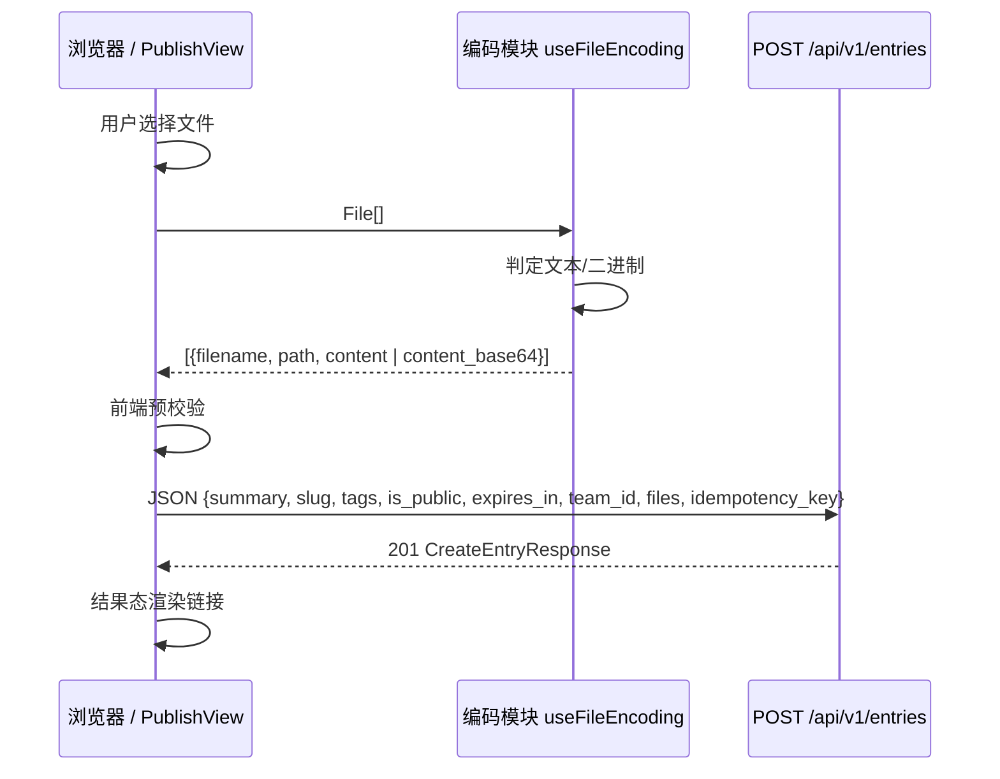

# PeekView 网页发布入口 需求与设计文档

**版本：** V1.1
**日期：** 2026-10-01
**状态：** 待评审
**任务编号：** 待立项（预计 TPV0100，任务名 `web-publish`）

## 1. 需求背景与目标

### 1.1 背景

PeekView 的定位是"Agent 写，人看，Agent 也能读"。当前内容录入通道共三条，全部面向 Agent：

- HTTP API（`POST /api/v1/entries`）
- CLI（`peekview create`）
- MCP Server（`publish_files` / `create_entry`）

这些通道中，CLI-remote、MCP-remote、MCP-local 最终都调用同一个端点 `POST /api/v1/entries`；例外是 **CLI-local**，它直接调用 `EntryService` 写库、不经端点。MCP 不是独立通道，只是 API 的一个客户端。

**缺口**：没有任何面向人类的网页输入入口。前端目前只负责浏览与管理（列表、详情、搜索、设置、团队、星标），对 entries 只有读 / 改可见性 / 改过期 / 删除，没有创建能力。

**典型痛点**：在未安装 CLI 或 MCP 的 Agent harness 中产出的成果往往是本地文件，该 harness 没有渠道把文件发布到 PeekView。用户只能手工把文件拷到另一个已接入 PeekView 的 Agent 环境，才能完成内容在 Agent 之间的传递。这条手工链路是当前最痛的摩擦点。

### 1.2 核心目标

- 为**已登录用户**提供网页发布入口，能力对标 MCP 的 `publish_files`。
- 用户可直接填写必要字段、选择文件（含多文件），发布为一个 entry。
- 发布完成后**立即给出页面链接与 raw 链接**，方便直接交给另一个 Agent 读取，替代手工拷贝。
- **后端零改动**：复用现有 `POST /api/v1/entries`，让网页成为该端点的第 4 个调用方（与 CLI-remote、MCP-remote、MCP-local 同契约）。

### 1.3 非目标（YAGNI）

- **不做文件编辑器**：本入口只做"上传 + 发布"，不提供内容编辑、diff、草稿。
- **不做文件夹选择与压缩包解压**：二期再评估（见 §10）。
- **不做 multipart / 分片 / 断点续传**：见 §6.1 方案取舍。
- **不做服务端路径输入**：不暴露 `local_path` / `dirs`（浏览器无法提供服务端路径）。
- **不做草稿、批量历史、发布模板**。

## 2. 名词定义

| 术语 | 定义 |
| :--- | :--- |
| **entry** | PeekView 的一次内容发布单元，含一个 summary、零到多个文件、一个 slug、可见性与过期策略。 |
| **slug** | entry 的短链标识，页面路径为 `/{slug}`；留空时服务端自动生成。 |
| **页面链接** | `{base_url}/{slug}`，人类在浏览器中打开的地址。 |
| **Raw 链接** | `{base_url}/{slug}/raw`，返回结构化 JSON；公开 entry 免认证可读，是交给其他 Agent 的主要凭据。 |
| **端点调用方** | 指以同一套 JSON 契约调用 `POST /api/v1/entries` 的客户端：CLI-remote、MCP-remote、MCP-local、本任务新增的网页，共 4 个。CLI-local 不经端点、直接调用 `EntryService`，不计入。 |
| **文本 / 二进制文件** | 前端判定：无 NUL 字节且能以 UTF-8 解码者为文本，否则为二进制。 |

## 3. 现状与约束

### 3.1 现有录入通道对比

| 通道 | 入口 | 文件来源 | 内容传输形态 |
| :--- | :--- | :--- | :--- |
| HTTP API | `POST /api/v1/entries` | 调用方自行组织 | JSON，`content`（文本）或 `content_base64`（二进制） |
| CLI remote | `peekview create <paths...>` | 本地磁盘 | 读文件后转同上 JSON，POST 给 API |
| CLI local | `peekview create <paths...>` | 本地磁盘 | 直接调用 `EntryService` 写库 |
| MCP local | `publish_files` | 服务端可访问的本地磁盘 | MCP 进程读文件后转 JSON，POST 给 API |
| MCP remote | `create_entry` | Agent 内联生成 | JSON，`content` |
| **本任务（网页）** | `/publish` | **浏览器选中的文件** | **JSON，`content` / `content_base64`** |

补充说明：

- **CLI-local 是唯一不经端点的通道**：它对文件读文本后直接构造 `files_data`，对目录则用 `dirs`（服务端扫描），从不使用 `local_path`。
- **MCP-local 不使用 `local_path` / `dirs`**：它在 MCP 进程内读文件，文本转 `content`、二进制转 `content_base64`，再 POST 给端点。因此"服务端路径扫描"能力实际只由 CLI-local 的 `dirs` 使用。
- 网页无法提供服务端路径，故本任务不涉及 `local_path` / `dirs`。

### 3.2 后端限额

| 配置项 | 默认值 | 说明 |
| :--- | :--- | :--- |
| `max_file_size` | 20 MB | 单文件上限 |
| `max_entry_files` | 50 | 单 entry 文件数上限 |
| `max_entry_size` | 100 MB | 单 entry 总大小上限 |
| `max_summary_length` | 500 | summary 字符上限 |
| `max_slug_length` | 64 | 自定义 slug 长度上限 |
| `default_expires_in` | `15d` | 默认过期时长 |
| 写端点限流 | 60/min | 共享限流，来自 `server.rate_limit_per_minute` |

限额的暴露方式如下：

- `GET /api/v1/config/limits`（免认证）返回 6 个字段：`default_expires_in`、`max_file_size`、`max_entry_files`、`max_entry_size`、`max_slug_length`、`max_summary_length`。前端应读取该接口驱动预校验与默认值，不硬编码这 6 个值。
- **限流不在该接口内**：它没有公开接口暴露，前端只能依据 `429` 响应做提示，不能预先读取。
- `max_content_length`（默认 1 MB）在配置中存在，但**当前代码未在任何路径强制执行**，不构成本方案的约束。

### 3.3 关键实现约束

以下三项约束直接影响前端实现的正确性，必须在此明确：

1. **`content_base64` 会被无条件标记为二进制。**
   后端 `entry_service.py` 的 `content_base64` 分支固定返回 `is_binary: true` 且 `language: null`。若文本文件误走 base64，将无法在详情页渲染、无语法高亮。因此前端**必须**自行判定文本 / 二进制：文本走 `content`，二进制走 `content_base64`。

2. **`path` 逃逸由后端兜底，前端需早校验。**
   `storage.py` 的 `get_disk_path` 将 `path` 拼到 entry 目录后 `resolve()`，要求结果仍处于 entry 目录内，否则抛 `ForbiddenPathError`。前端应在提交前拒绝绝对路径与含 `..` 段的路径。

3. **后端不对 `path` 查重。**
   若同一 entry 内两个文件 `path` 相同，会互相覆盖并产生两行 File 记录。前端必须拦截重复路径。

## 4. 用户流程

```mermaid
flowchart TD
    A[登录用户] --> B{入口}
    B -->|UserMenu 下拉 Publish| C[/publish 页面]
    B -->|Explore 页主按钮| C
    C --> D[填写 summary 与可选字段]
    D --> E[选择/拖拽文件]
    E --> F[逐文件判定文本或二进制]
    F --> G[按需编辑相对路径]
    G --> H{前端预校验}
    H -->|不通过| I[就地提示, 阻止提交]
    H -->|通过| J[POST /api/v1/entries]
    J -->|201| K[结果态: 页面链接 + Raw 链接]
    J -->|错误| L[显示错误, 保留表单可重试]
    K --> M[查看详情 / 再发一个]
```

关键行为：

- 发布前表单状态完整保留在页面内，提交失败不丢失已选文件与已填字段。
- 提交按钮在请求进行中禁用，并展示上传进度。
- 结果态突出可复制的页面链接与 Raw 链接，并提供跳转详情页的入口。

## 5. 功能需求

### 5.1 入口与路由

| 项 | 需求 |
| :--- | :--- |
| 路由 | 新增 `/publish`，对应 `PublishView.vue` |
| 全局入口 | `UserMenu.vue` 下拉新增 `Publish` 项（该组件被多页复用，改一处全站生效；DESIGN.md 要求 "Same menu content across all pages"） |
| 页面入口 | `EntryListView.vue` 顶部新增主按钮 `Publish`。注意该组件同时服务 `/explore` 与 `/users/:username`（`props.owner`），按钮**仅在 `!props.owner` 且已登录时渲染**，避免出现在他人主页 |
| 鉴权 | 必须登录。未登录访问 `/publish` 时重定向到 `/`，沿用 Settings / Teams / Stars 的既有惯例 |
| 可见性 | `UserMenu` 与主按钮仅在已登录（`authState === 'authenticated'`）时渲染 |

### 5.2 表单字段

| 字段 | 必填 | 默认值 | 说明 |
| :--- | :--- | :--- | :--- |
| `summary` | 是 | 空 | 1–500 字符，带实时字数计数 |
| 文件 | 是 | 空 | 至少 1 个；见 §5.3、§5.4 |
| `slug` | 否 | 空 | 留空由服务端自动生成；填写时≤64 字符 |
| `tags` | 否 | 空 | 标签列表，回车添加、可移除 |
| `is_public` | 否 | **公开** | 开关；默认公开，与现有端点调用方默认一致 |
| `expires_in` | 否 | `15d` | 下拉预设；默认值取 `GET /api/v1/config/limits` 的 `default_expires_in` |
| `team_id` | 否 | 空 | 有团队时可选；选择后该 entry 为团队私有 |

### 5.3 文件选择与编码

- 支持多选：`<input type="file" multiple>` 与拖拽投放。
- 对每个文件：
  - **文本**：读取为字符串，填入 `content`，同时提供 `filename`。
  - **二进制**：读取为 `ArrayBuffer` 并 base64 编码，填入 `content_base64`，同时提供 `filename`。
- 判定规则：出现 NUL 字节视为二进制；否则尝试 UTF-8 严格解码，失败视为二进制。该规则与**后端** `language.py` 的 `is_binary_content` 一致。注意 MCP 的 `looksBinary` 实际只检查前 8000 字节是否含 NUL，比本规则宽松，**不可**作为对齐基准——否则会漏掉"无 NUL 但非合法 UTF-8"的二进制文件。
- 文件列表展示：文件名、大小、文本/二进制徽标、可编辑相对路径、移除按钮。

### 5.4 相对路径编辑

- 每个已选文件有一行**可编辑的相对路径**，默认值为文件名本身。
- 用途：MVP 即可手工构造目录结构。例：选择 `a.txt` 与 `b.cs`，把后者路径改为 `src/b.cs`，发布后文件树呈现 `a.txt` 与 `src/b.cs`。
- 提交时该值映射到 `FileCreate.path`（含叶子名），`filename` 取叶子名。
- 前端校验：非空、不以 `/` 开头、不含 `..` 段、同 entry 内不重复；并受后端字段长度上限约束，即 `path` ≤ 500 字符、叶子文件名 ≤ 255 字符。
- 二期"选择文件夹"能力只需批量预填这些 `path` 字段，数据结构不变。

### 5.5 提交与结果

- 请求：`POST /api/v1/entries`，JSON body，携带 `idempotency_key`（见 §6.5）。
- 成功后进入**同页结果态**（不新增路由），展示：
  - 页面链接 `{base_url}/{slug}`，带复制按钮。
  - Raw 链接 `{base_url}/{slug}/raw`，带复制按钮（标注"给 Agent 用"）。
  - 过期时间。
  - 「查看详情」跳转 `/{slug}`；「再发一个」重置表单。
- 响应字段来自 `CreateEntryResponse`：`id` / `slug` / `url` / `is_public` / `owner_id` / `expires_at` / `created_at` / `files`。Raw 链接由前端基于 `slug` 拼接。

### 5.6 错误处理

| 场景 | 处理 |
| :--- | :--- |
| 未选 summary | 就地提示，禁止提交 |
| 未选文件 | 就地提示（"至少选择一个文件"） |
| 文件数 > 50 | 预校验拦截，提示上限 |
| 单文件 > 20 MB | 预校验拦截，指出具体文件 |
| 总量 > 100 MB | 预校验拦截，提示当前总量 |
| 路径非法 / 重复 | 预校验拦截，标红对应行 |
| 401 | 由 axios 拦截器统一处理（登出 + 广播 `peekview:auth-expired`） |
| 422 / 400 | 显示后端返回的 detail |
| 429 | 提示限流，稍后重试 |
| 5xx / 网络失败 | 保留表单与文件，允许重试。**载荷未变**时复用同一 `idempotency_key`；一旦编辑任何字段或文件集合，则重新生成（规则见 §6.5） |

## 6. 技术设计

### 6.1 架构方案取舍

| 方案 | 做法 | 结论 |
| :--- | :--- | :--- |
| **A（采用）** | 前端将文件内容内联进 JSON，一次 POST 现有端点 | 后端零改动、与 CLI-remote / MCP 同契约、单请求原子创建；代价是 base64 膨胀约 33%，超大 entry 有内存压力 |
| B | 新增 multipart 上传端点 | 真流式、无膨胀、进度更准；但需新增端点、新校验、适配 `EntryService`，长期维护两套创建路径 |
| C | 分片 / 断点续传（tus 等） | 对当前需求为过度设计，排除 |

选择 A 的理由：现有三个端点调用方（CLI-remote、MCP-remote、MCP-local）都走该端点，网页只需成为第 4 个端点调用方；在单 entry ≤ 100 MB 的限额内，A 的短板只在极端大包时显现，而首版明确不做文件夹 / 压缩包，典型场景是"几个文件交给另一个 Agent"。待出现常传大包的真实需求，再单独立项做 B。

### 6.2 数据流



### 6.3 前端模块改动

| 文件 | 改动 |
| :--- | :--- |
| `frontend-v3/src/api/client.ts` | 新增 `createEntry(payload)`；新增 `getLimits()`（当前前端无任何 limits 消费者，§3.2/§5.2 依赖它，必须一并实现） |
| `frontend-v3/src/api/types.ts` | 新增创建请求 / 响应、limits 响应的 raw 类型 |
| `frontend-v3/src/types/index.ts` | 新增领域类型 |
| `frontend-v3/src/views/PublishView.vue` | 新增，页面编排（表单状态、提交、结果态） |
| `frontend-v3/src/composables/useFileEncoding.ts` | 新增，文本 / 二进制判定与 base64 编码（纯函数，便于单测） |
| `frontend-v3/src/components/FileDropZone.vue` | 新增，拖拽 + 文件选择 |
| `frontend-v3/src/components/PublishFileList.vue` | 新增，已选文件列表与相对路径编辑 |
| `frontend-v3/src/router.ts` | 新增 `/publish` 路由与未登录守卫 |
| `frontend-v3/src/components/UserMenu.vue` | 新增 `Publish` 入口 |
| `DESIGN.md` | 菜单内容在 `DESIGN.md` 中被文书化为 "(Settings, Teams, Logout)"，新增 `Publish` 后需同步更新该处设计系统描述 |

拆分说明：`FileDropZone.vue` 与 `PublishFileList.vue` 自始创建，不采用"先内联、超行数再拆"的临时路径——参考 `EntryDetailView` 拆分的教训，避免再次形成 god component。

复用既有组件：`BaseButton`、`BaseTag`、`LoginDialog`、`PageHeader`、`EmptyState`、`useToast`。无需新增 Pinia store，页面本地状态足够。

### 6.4 请求契约

复用现有端点，无新增字段：

```json
{
  "summary": "示例发布",
  "slug": null,
  "tags": ["demo"],
  "is_public": true,
  "expires_in": "15d",
  "team_id": null,
  "files": [
    { "filename": "a.txt", "path": "a.txt", "content": "hello" },
    { "filename": "b.cs", "path": "src/b.cs", "content_base64": "..." }
  ],
  "idempotency_key": "uuid-v4"
}
```

响应 `201`（幂等命中为 `200`）：

```json
{
  "id": 123,
  "slug": "abc123",
  "url": "https://example.com/abc123",
  "is_public": true,
  "owner_id": 1,
  "expires_at": "2026-10-16T00:00:00Z",
  "created_at": "2026-10-01T00:00:00Z",
  "files": []
}
```

### 6.5 幂等

`idempotency_key` 代表"**同一份载荷**的幂等重试"，键与载荷一一对应。判定优先级：

1. 用户点击 `Publish` 时，若当前无 key（首次提交，或上一次成功后重置），生成一个新 UUID。
2. 提交失败后**原样重试**（summary / slug / tags / 可见性 / 过期 / 团队 / 文件集合 / 文件相对路径均未变）→ 复用当前 key。
3. 提交失败后用户**修改了上述任一字段或文件集合** → 视为新的发布意图，重新生成 key。
4. 结果态点击"再发一个" → 清空表单并重新生成 key。

这样"请求失败后原样重试不产生重复 entry"可被确定为可测行为（验收要点第 8 条）。

## 7. 安全与边界

- **认证**：必须登录；认证走 httpOnly cookie，前端不手动附加 token。
- **归属**：`owner_id` 由服务端依据 cookie 用户确定，前端无法伪造。
- **路径安全**：前端早校验 + 后端 `get_disk_path` 逃逸兜底。
- **不得暴露**：不提供 `local_path` / `dirs` 输入，避免把服务端磁盘读取能力暴露给浏览器。
- **公开默认的提示**：默认公开意味着任何持有链接者可匿名读取，表单需让用户清楚看到当前可见性状态。

## 8. 测试策略

| 层级 | 覆盖 |
| :--- | :--- |
| 单元测试（vitest） | 文本 / 二进制判定、base64 编码、预校验（数量 / 单文件 / 总量 / 路径）、payload 构造 |
| 组件测试 | `PublishView` 表单校验、文件增删、路径编辑与重复检测 |
| E2E（Playwright） | 登录 → `setInputFiles` 真实文件 → 填写 summary → 发布 → 结果态 → 链接可访问 → 详情页文本正确渲染、二进制可下载 → `afterEach` 清理 |

E2E 约束（沿用项目既有规范）：

- 必须指向 debug backend `127.0.0.1:8888`，绝不指向生产 `:8080`。
- 创建的 entry 使用 `e2e-` 前缀确定性 slug，并在 `afterEach` 按后端返回的 `created.slug` 清理，防残留。
- 截图证据须落到 `evidence/` 副本（Playwright 每次运行会清空 `test-results/`）。

## 9. 验收要点（P1 将形式化为 BDD）

初步验收方向，P1 需求基线阶段将展开为 Given/When/Then 用例：

1. 登录用户可从 UserMenu 与 Explore 页进入 `/publish`。
2. 未登录访问 `/publish` 被重定向到 `/`。
3. 选择多文件（含文本与二进制）后能成功发布，文本在详情页正确渲染、二进制可下载。
4. 编辑相对路径后可构造出嵌套目录结构并在文件树中正确呈现。
5. 结果态展示页面链接与 raw 链接且可复制；raw 链接对公开 entry 免认证可读。
6. 预校验在超限 / 路径非法 / 路径重复 / 空 summary / 无文件时阻止提交并给出提示。
7. 默认可见性为公开，过期时间默认 15 天。
8. 请求失败后表单与已选文件保留，重试不产生重复 entry。
9. 通过本入口创建的 entry，其 `owner_id` 归属登录用户。

## 10. 待决事项

| 编号 | 事项 | 说明 |
| :--- | :--- | :--- |
| OQ-1 | ~~`X-PeekView-Source: web`~~ **已决** | 复核结论：**创建端点 `POST /api/v1/entries` 根本不消费该头**；仅读端点的 `_detect_channel` 消费，且只识别 `"mcp"`。故本任务**不添加**该头（保持后端零改动）。若未来要对创建做来源归因，需改后端 `_detect_channel`，单独立项 |
| OQ-2 | 空文件（0 字节）处理 | 是否允许发布 0 字节文件，需在 P1 明确 |
| OQ-3 | 同名不同路径的判定 | 默认路径即文件名，两个不同目录下的同名文件需用户手动改路径；是否在 UI 上主动提示 |
| OQ-4 | 大文件体验 | 若实测发现接近上限的文件体验不可接受，重新评估方案 B（P2 阶段可实测） |

## 11. 变更记录

| 日期 | 版本 | 变更 |
| :--- | :--- | :--- |
| 2026-10-01 | V1.1 | 依据独立评审迭代：①修正"三条通道都汇聚同一端点"的事实错误（CLI-local 直接调用 `EntryService` 不经端点；涉及 §1.1 / §2 / §3.1 / §6.1），术语"同构客户端"统一改为"端点调用方" ②修正 §3.2 误称限流经 `/config/limits` 暴露（实际只暴露 6 个字段，限流无公开接口），补 `max_content_length` 未强制执行说明 ③补 §6.3 缺失的 `getLimits()` 客户端方法与 `DESIGN.md` 菜单描述同步 ④明确 §5.1 Explore 按钮的渲染 gate（`!props.owner`，避免出现在他人主页）⑤修正 §5.3 对 MCP 判定规则的错误归因（MCP 仅查 NUL 且只查前 8000 字节）⑥补充 §5.4 的 `path`/`filename` 长度上限 ⑦消除 §5.6 与 §6.5 的幂等键复用冲突（明确"载荷变则换 key"优先级）⑧OQ-1 结案（创建端点不消费来源头） |
| 2026-10-01 | V1.0 | 初稿。基于 brainstorming 澄清：MVP 只做文件 / 多文件；默认公开；全字段；入口两处；至少 1 个文件；支持相对路径编辑；方案 A（复用现有端点，后端零改动）。 |
