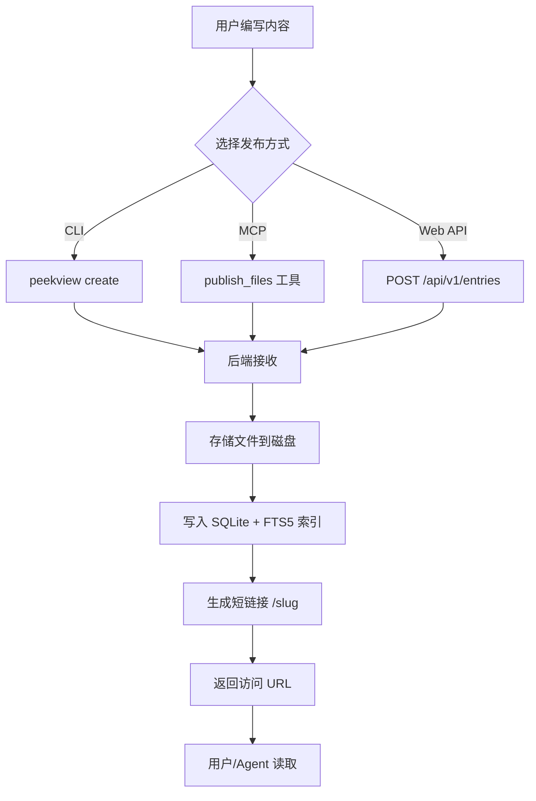

# 用户发布 Entry 流程

```mermaid
graph TD
    A[用户编写内容] --> B{选择发布方式}
    B -->|CLI| C[peekview create]
    B -->|MCP| D[publish_files 工具]
    B -->|Web API| E[POST /api/v1/entries]
    C --> F[后端接收]
    D --> F
    E --> F
    F --> G[存储文件到磁盘]
    G --> H[写入 SQLite + FTS5 索引]
    H --> I[生成短链接 /slug]
    I --> J[返回访问 URL]
    J --> K[用户/Agent 读取]
```
