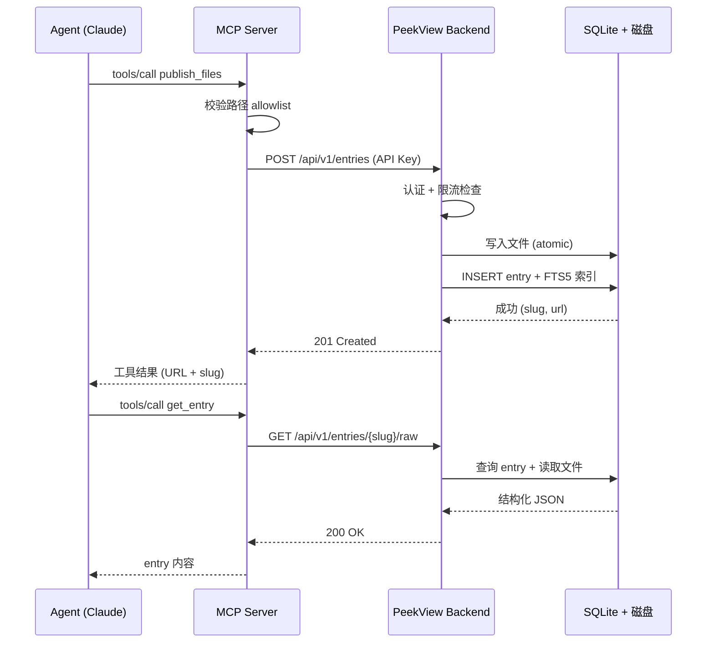

# MCP 请求时序

```mermaid
sequenceDiagram
    participant A as Agent (Claude)
    participant B as MCP Server
    participant C as PeekView Backend
    participant D as SQLite + 磁盘

    A->>B: tools/call publish_files
    B->>B: 校验路径 allowlist
    B->>C: POST /api/v1/entries (API Key)
    C->>C: 认证 + 限流检查
    C->>D: 写入文件 (atomic)
    C->>D: INSERT entry + FTS5 索引
    D-->>C: 成功 (slug, url)
    C-->>B: 201 Created
    B-->>A: 工具结果 (URL + slug)

    A->>B: tools/call get_entry
    B->>C: GET /api/v1/entries/{slug}/raw
    C->>D: 查询 entry + 读取文件
    D-->>C: 结构化 JSON
    C-->>B: 200 OK
    B-->>A: entry 内容
```
